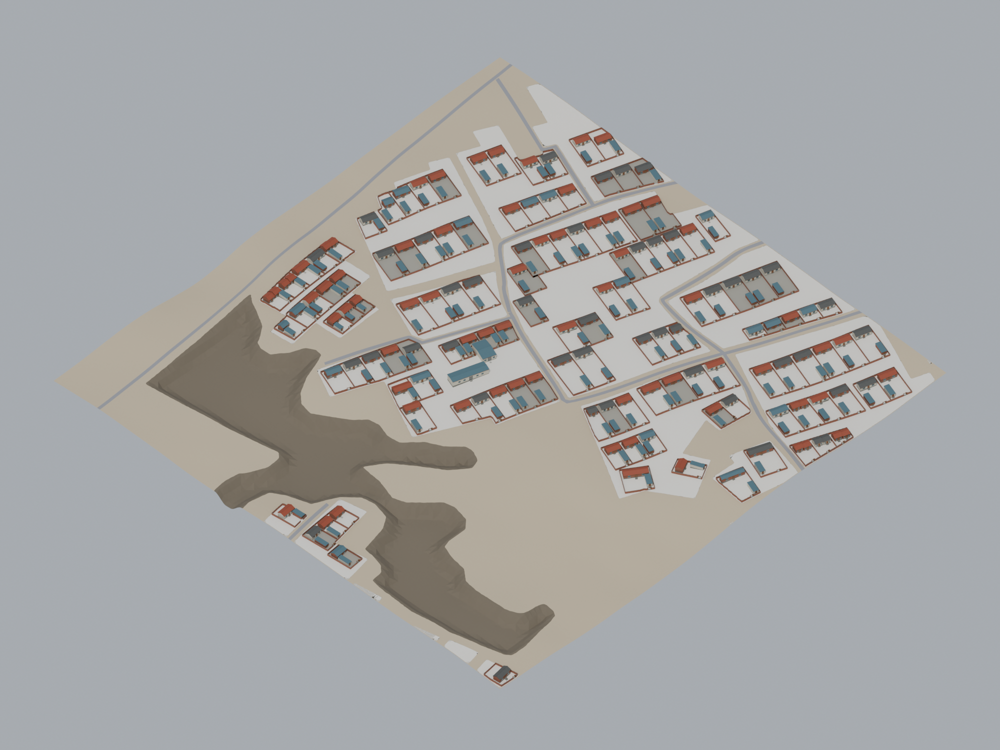
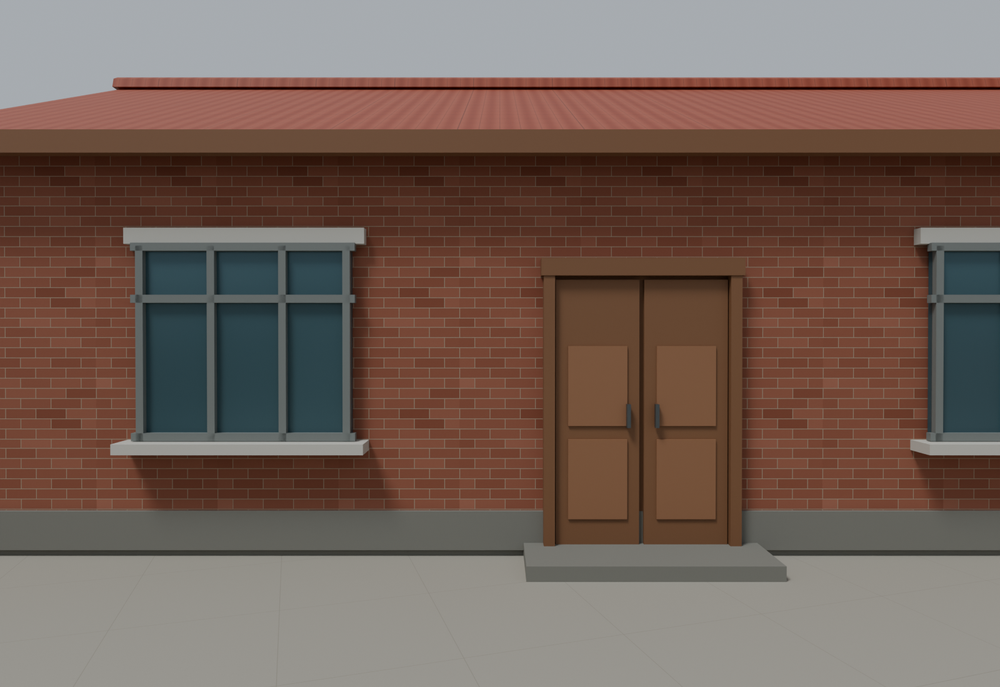
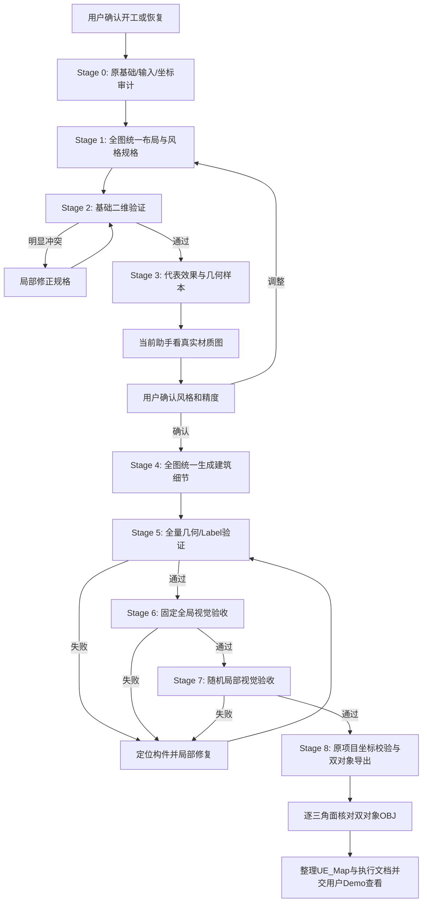

# 建筑细节完整执行管线（手动对话启动的独立版）

## 0. 从 3DMap 到建筑细节模块

完整上游地图项目见 [3DMapRebuilder](https://github.com/getyo/3DMapRebuilder)；本模块是其独立下游仓库，接口以本文和 `run_config.json` 为准。

`3DMapRebuilder` 的上游流程先由卫星图、矢量图和 DEM 得到语义标签；标签后处理生成 10 倍分辨率的 `labels_10x_no_boundary.tif`；自适应地形模块生成 Building、Ground 和 Water 的原始地形 OBJ，水体模块另行生成流场。建筑细节是依赖 Building Label 与原 Building 地形的后续可选模块，不取代这些上游结果，也不改动水体、道路、Ground 或 UE 语义层。

建筑细节模块读取上游 Building 基础、Ground 上下文、Label、卫星图和 `map_common.py` 坐标函数。用户在 Codex 中手动开启独立对话；会话从卫星图与风格参考理解布局和建筑类型，形成本轮风格规格与全图任务清单；Python/Blender 按规格计算贴地、共享院墙、几何和导出。最终仅交付 `BuildingDetails` 与 `CourtyardDetails` 两个新增细节对象，并在 UE 中与原地形叠加。不设置 3DMap 代码调用入口，也不改变建筑细节在整体流程中的位置。

本文是可单独阅读的完整执行版，保留 Stage 0–8、视觉目标、约束与验收规则。**实际路径、风格复用策略和输出由根目录 `run_config.json` 决定**。旧任务与旧成品不能作为本轮位置答案；经用户确认并分类入库的风格参数可依下文规则复用。

### 0.1 新会话定位

你是本轮建筑细节模块的视觉规划者、脚本执行者和验收者。先理解 3DMap 上游产物，再按本文件逐阶段执行。你需要从原始图像理解建筑与院落，写出本轮风格配置和本轮任务清单；运行同一模块生成代表效果和全图；亲自查看正式材质渲染图；按问题 ID 返工。用户确认代表风格后才批量生成全图。只有下文说明的通用脚本错误或能力缺口才修改执行器副本，不因单个位置或颜色判断而改代码。

### 0.2 本轮交接边界

新会话读取 `inputs/`、`engine/`、本文和 `run_config.json`。`inputs/style_references/` 按风格类别命名子目录；`style_catalog/rural_hebei/` 已保存最初成功交付的农村风格参数及配套贴图，可在视觉判断适用时复用。独立包不附带这轮独立 Stage 3 生成的风格、旧任务清单、成品 OBJ 或本轮验收图；下方历史预览仅用于理解验收画面。所有本轮配置、场景和报告写入 `outputs/`。

### 历史建筑验收图示例

以下两张为先前建筑交付的**模块自身固定视角渲染验收图**，分别用于查看全图建筑与院落关系、5.5 米立面细节。原始图片的 SHA-256 与先前 `fixed_visual_review.json` 记录一致，记录结论为通过。它们仅展示建筑模块的验收画面，不是 UE 截图，也不替代**本轮独立版** Stage 3、6、7 的新渲染和视觉验收。

| 全图斜视：布局、屋顶和院落关系 | 5.5 米立面：门窗、屋面与入口细节 |
|:--:|:--:|
|  |  |

### 0.3 配置复用规则

`run_config.json` 的 `style.mode` 可取 `auto`、`new` 或 `named`。默认 `auto`：先由新会话看卫星图判断农村、城市及地区特征，再读取 `inputs/style_references/` 下名称明确的对应风格参考目录，并查 `style_catalog/` 对应类别。适用的已确认参数可以复用或在本轮派生调整，并记录依据；没有适用参数而有对应参考图时，从参考图创建。没有适用参数且没有对应风格参考图片时，**立即停止 Stage 1，向用户索要参考图片**，不能凭空创造风格。`new` 跳过参数库，但仍必须有对应参考图；`named` 指定参数也须检查是否适用于本轮场景。目录名是检索线索，实际图片内容和适配性须由会话判断。

`tasks.mode` 可取 `fresh` 或 `reuse`。默认 `fresh`：每张地图都由本轮卫星图、Label 和用户要求重新建立全图任务清单；风格参数复用不会带来旧建筑位置。`reuse` 只在用户明确指定旧任务文件时考虑。先比对卫星图、Label、原基础、坐标函数的哈希与图像尺寸，再由 Astra 查看旧任务的位置、方向、院落关系是否与本轮地图一致，并记录依据。缺少来源信息、出现不匹配或无法判断时暂停，向用户说明差异并询问是重新规划还是有意迁移旧任务；在明确处理前不得生成。旧任务的文件格式不兼容时也须先迁移并重验，不能直接载入。

### 0.4 返工时的代码修改边界

保持原 Stage 2、3、5、6、7 的检查和看图环节。问题先记录图号、对象 ID、位置和现象，再分类处理：单个或少量对象的布局、尺寸、朝向、选材问题修改本轮任务或风格参数；同一原型反复出现的几何错误修改隔离执行器的通用模板；确需新房型时增加有明确输入字段的新原型。不得为了让单张图过关隐藏对象、放松 Label 和坐标约束、修改原 Building 基础或把特殊对象 ID 写成通用规则。

代码修改须记录原因、改动文件、受影响的原型和回归范围。修改通用模板后重验该模板全部实例，再运行全量几何检查及固定、随机渲染验收。视觉质量判断按原 Stage 3、6、7 的真实图片和用户确认执行，不能以某个既有成品哈希充当通用验收标准。

### 0.5 手动启动、断点与停止条件

上游产物存在且哈希/坐标审计通过后才能进入建筑模块。用户手动启动或恢复 Codex 对话；默认复用与当前输入、风格和任务哈希匹配的有效本轮输出，显式要求重建或上游版本变化时才重新建模。额度不足、断网、缺少视觉理解能力或风格来源不足时记录原因，在相应关口停止，不把半成品标为成功。恢复时从有效断点继续。只有双对象 OBJ、几何验证及正式验收图均绑定同一模型版本且通过原管线检查，才能交付。

---

> 目标：在原 Building 地形上生成可展示的低模建筑细节，按原项目坐标交付只含新增细节的双对象 OBJ。
> 本文包含完整输入、阶段、验证和交付规则，可单独执行；文内路径均为绝对路径或以专用工作区为根的相对路径。

执行主体为本轮独立会话，默认模型为 GPT-6 Astra（中等推理强度），直接运行本机 Python 和 Blender。全图在同一坐标与布局规格下统一生成；对象 ID 用于局部返工。代表风格由用户确认后进入全图；不设置十分之一片区确认环节。任务暂停与恢复依据专用工作区状态和阶段完成记录。

## 1. 结论与目标边界

任务是在用户原有 `terrain_building.obj` 的表面设计房屋、屋顶、门窗、院墙、院门、附属房、院内铺地和未分类视觉小路。原地形只作为贴地、坐标和渲染检查的只读承托。

原有 `terrain_building.obj` 必须保留，不写入最终交付 OBJ。最终 `BuildingDetails.obj` 只含新增细节；在 UE 中与已有原地形叠加显示。不得在工程里导入第二份 Building 地面造成重面，也不得为了细节生成去改写、遮盖或替换原地形。

Demo目标是给领导展示时够看、像样：从五六米可认出房子、门窗、屋顶和院墙；俯视和鸟瞰时空间布局合理、配色有变化、院落像一个真实村落环境。不是测绘级数字孪生，不做高精度写实资产。显存、时间和额度优先受控，用户的水体扩散与语义层仍是项目重点。

本管线不修改：

- 原工程、原始输入、原始terrain模型、Label和DEM；
- Ground、Road、Water语义；
- 水体中心线、速度场、UV、UE蓝图和扩散表现；
- Git状态或任何Git内容。

卫星图是布局软参考；Building Label是硬边界。边界裙边沿原工程处理或暂缓，不是当前重点。

## 2. 视觉目标

### 2.1 空间布局

卫星图用于判断主要建筑位置、方向、密度、院落和内部小路的大体关系。模糊或缺失内容由当前助手结合本轮适用的风格参考图进行合理推断；不追求逐像素、逐栋精确拟合。

Building Label决定新增建筑相关内容最多能出现在哪里，不要求用房屋铺满Label。Label内部可以保留院子、空地和视觉小路。

在同一坐标系、同一布局规格和同一套生成器中直接生成全图。保留卫星图参考、布局规格与二维验证，不把地图切成独立区域分别识别、规划、建模或验收后再拼接。房屋、共享院墙、院门和附房之间的关系均在全图规格中定义，避免断墙、重复房屋或遗漏关系。

首次生成面向全图；返工按问题ID定位到具体对象或关系，只修改受影响部分。保存稳定ID、生成参数和断点，避免为局部问题重做全图。若确有内存或运行时间瓶颈，可在同一全图任务内部按对象批量计算；这仅是资源调度，不引入地图分区、独立布局或新增用户确认环节。

### 2.2 建筑细节

- 主屋、附房和厂房在轮廓上能区分。
- 房屋有双坡、单坡、平顶或低坡厂房顶等合理屋顶，方向与卫星长轴大致一致。
- 五六米距离可辨认门、窗、墙、屋顶、屋脊和院墙。
- 门窗使用低成本的框边、分格或浅层次；不能退化为统一的蓝色/棕色矩形面板。
- 院墙有合理的高度、厚度和门口留空；不穿过房屋、不封住院门、不跨院封成巨大三角面。
- 细节类型可共享模板，但房屋比例、门窗位置、屋顶颜色和院落组合不能完全机械重复。

### 2.3 材质与性能

保留用户在本轮 Stage 3 认可的空间布局与颜色材质方向。红砖、灰白抹灰、红灰瓦、蓝灰彩钢和水泥院落只是农村场景示例；实际材质由本轮风格参数决定。

材质槽按用途命名为 `M_Building_<用途>`，例如：

```text
M_Building_GrayWall
M_Building_BrickWall
M_Building_RedTileRoof
M_Building_BlueMetalRoof
M_Building_Door
M_Building_WindowGlass
M_Building_WindowFrame
M_Building_Courtyard
M_Building_VisualPath
```

材料类别不预先锁死；同类材质全图共享，不逐栋复制。优先使用共享1024²贴图，必要时少量2048²贴图；不做逐栋PBR或复杂室内材质。

新增建筑细节建议控制在约100k–350k三角面，500k为需解释的警戒值，不是最低目标。原基础地形面数单独统计。交付 OBJ 只含两个 `o` 对象：`BuildingDetails`（房屋、附房、屋顶、门窗、基座、入口台阶）和 `CourtyardDetails`（院墙、院门、铺地、视觉小路）。两个对象共用按用途命名的材质槽、UV 和贴图，不按每个门窗或墙段分别导入。

## 3. 核心数据契约

### 3.1 输入与权限

| 输入 | 路径 | 用途 | 权限 |
|---|---|---|---|
| 原Building基础 | `inputs/map/terrain_building.obj` | 贴地、对齐和验收参考；不并入交付 OBJ | 只读 |
| Ground上下文 | `inputs/map/terrain_ground.obj` | 同场对齐参考，不合入成品 | 只读 |
| 卫星图 | `inputs/map/satellite.tif` | 布局软参考 | 只读 |
| DEM | `run_config.json` 指定；已有原基础时可选 | 高程合理性核对 | 只读 |
| Label | `inputs/map/labels_10x_no_boundary.tif` | 建筑硬边界 | 只读 |
| 坐标函数 | `inputs/map/map_common.py` | 唯一坐标常量来源 | 只读 |
| 风格参考 | `inputs/style_references/` | 建筑风格软约束 | 只读 |

运行前只读审计原Building基础的哈希、面数、AABB、材质依赖和UV；不能把旧AI输出中同名 `terrain_building.obj` 当作输入基础。

### 3.2 Label

Band1语义：

```text
0 = Water
20 = Road
40 = Building
60 = Ground
```

新增墙体、屋顶、屋檐、门窗外凸、院墙、门柱、附属房和视觉小路的完整XY投影必须包含在 `Band1 == 40` 内。不能只检查中心点或顶点，不能用“允许一个像素越界”掩盖错误。

院子里有自己的房子是正常关系；院墙穿屋、邻屋实体互穿、院子被错误屋盖封住不是正常关系。

### 3.3 坐标与单位

必须调用 `map_common.py`，不复制或另写一套常量。原项目 `gen_adaptive_terrain_centerline.py` 的 `_write_obj` 输出右手系 OBJ；同一项目的细节 OBJ 必须采用相同文件坐标，不能提前用中心线 CSV 的 UE 世界 Y 值代替 OBJ Y。

```text
PX_M = 0.458 m
SCALE = 10
UE_SCALE = 100
UE_PER_PX10 = 4.58 cm

X = (c10 - w10/2) × 4.58
Y = (h10/2 - r10) × 4.58
Z = DEM高程(米) × 100
```

OBJ坐标为右手系、Z-up、厘米，原点是整张10倍图像中心。图像列向右增大对应X增大，图像行向下增大对应Y减小。原地形 OBJ 和细节 OBJ 的 XYZ 在文件中采用同一规则。`ue_y_csv_of_row` 用于直读到 UE 世界的 CSV，不能用于 OBJ。

逆变换为：

```text
c10 = X / 4.58 + w10/2
r10 = h10/2 - Y / 4.58
```

得到的已经是10倍Label索引，不能再次除以10。实现时分别使用实际宽高，不假定图像永远正方形。

## 4. 总体流程图



诊断图可用于定位问题，但不能代替正式验收。修改局部构件时仅重验受影响部分；若修改通用模板，则检查该模板的全部实例。

Stage 0至Stage 8按顺序执行。若代表风格已有有效的用户确认记录，恢复时可从全图规格检查继续，不重复确认；未确认时必须先完成Stage 3。全图任务不再增加十分之一片区确认环节。

## 5. 分阶段执行

### Stage 0：原基础、输入与坐标审计

职责：确认原基础身份和地图坐标关系，不重新制作地形。

检查：

- 原基础OBJ的哈希、顶点/面数、AABB、UV、MTL和贴图依赖；
- 卫星图、DEM、Label的尺寸、范围和对齐；
- Label中Building/Water/Road/Ground面积；
- DEM有效高度范围；
- 至少三个非共线坐标锚点；
- 原基础与Ground同场显示是否对齐；UE现有地形Actor的平移、旋转和缩放须只读核对，若无UE接口则在实际导入验收中核对。

输出：

```text
work/audit/input_manifest.json
work/audit/coordinate_contract.json
work/audit/overlay_satellite_label.png
```

原基础导入Blender的 `BaseTerrain` 集合并锁定；新增物进入 `Details`；Ground进入只读 `Context`。原基础网格、UV与位置不能被生成器改写，也不能进入细节交付 OBJ。

### Stage 1：全图统一布局与可执行规格

当前助手查看卫星全图、Label叠加和风格参考图，输出全图统一的 `style_spec.json` 与 `layout_spec.json`，供同一生成器直接生成全图。此阶段不产生用于独立生成和拼接的地图分区。

每栋或每类建筑必须明确：

- 稳定ID、轮廓、朝向、类型、层数、墙高；
- 屋顶类型、坡度、屋脊方向；
- 墙面和屋顶材质搭配；
- 门窗所在立面、数量、尺寸和简化窗框样式；
- 院墙、院门、附房、院内视觉小路的位置；
- 与原基础的贴地方式；
- 不确定区域采取的简单合理默认。

示例接口：

```json
{
  "style_revision": "STYLE_001",
  "coordinate_space": "image_px1",
  "buildings": [{
    "id": "B_0001",
    "footprint_px1": [[100,100],[120,100],[120,110],[100,110]],
    "archetype": "rural_house",
    "orientation_deg": 0,
    "wall_height_m": 3.4,
    "roof_type": "gable",
    "roof_pitch_deg": 25,
    "wall_material": "M_Building_BrickWall",
    "roof_material": "M_Building_RedTileRoof",
    "facades": [{
      "edge_index": 0,
      "door": {"width_m": 1.0, "height_m": 2.1, "offset_ratio": 0.5},
      "windows": [{"width_m": 1.2, "height_m": 1.2, "offset_ratio": 0.2}],
      "window_style": "simple_frame_two_panes"
    }]
  }],
  "walls": [{
    "id": "W_0001",
    "geometry_kind": "strip_polygon",
    "outer_px1": [],
    "holes_px1": [],
    "height_m": 1.8,
    "gate_ids": ["G_0001"]
  }]
}
```

样例只说明字段，不代表实际布局。墙带必须标明是中心线、窄带多边形还是院落外轮廓；生成器不得自行猜测。

### Stage 2：基础二维验证

当前助手运行确定性检查，并结合实际图像判断视觉与布局问题。数值检查和视觉判断均由同一助手完成，检查标准不变。

必须检查：

1. 所有新增构件的预估包络在Label40内。
2. 轮廓有效，无自交、零面积和无法建模的碎片。
3. 院墙不穿房，非预期实心体不重叠；屋檐、外凸窗台、门柱和墙体包络也不得越出Label40。
4. 房门朝自家院子，院门留口合理，明显门口未被院墙封死。
5. 院落有可理解的开敞空间。

不作为阻塞：全图道路连通、每扇门到主路可达、统一巷宽、卫星逐像素拟合、建筑Label覆盖率。

输出：

```text
work/layout/layout_overview.png
work/layout/layout_clean.png
work/layout/layout_check.json
work/layout/issues.json
```

失败必须定位到具体ID、坐标和关系，不能只给总失败数量。

### Stage 3：代表效果和用户确认

从已通过二维检查的规格中选实际主屋、附房、院墙、门窗；原基础仅同场承托和显示。使用将用于全图的相同方法生成代表效果。

先验证：凹墙带正确三角化、屋顶与墙闭合、门窗附着、原基础承托和坐标尺度。不要将未经验证的墙体/屋顶构造直接铺到全图。

给用户看：

1. 原基础同场显示、主屋、院墙和附房的斜视正常材质图；
2. 正对门窗、距离立面5–6m的正常材质图；
3. 院落俯视布局图；
4. 面数、共享材质槽和纹理解码规模摘要。

当前助手先看实际图；用户确认“这个档次和风格可以”后，才进入全图。若用户不满意，回到Stage 1调整规格，不在全图成品上盲修。确认记录、风格版本和图像哈希必须保存；恢复时用记录决定是否需要重复确认。

### Stage 4：全图统一生成低模细节

使用已检查的全图统一规格和已确认的代表风格，由当前助手直接运行本机脚本与Blender完成全图生成。不按地图区域拆成独立生成任务，不设置局部片区预览确认环节。稳定对象ID用于记录、检查和后续局部返工。

生成顺序：

1. 对房屋、院墙、门口和铺地的完整足迹，在原基础实际三角面上求覆盖、高程上下限与坡度；缓坡用水平地坪，较大坡差先缩小足迹或拆成错层房体，并设置合理台基与入口台阶；
2. 生成闭合外墙；
3. 生成闭合屋顶、必要屋脊和檐口；
4. 增加门窗及低成本框边/分格；
5. 从全图院落边界建立共享院墙网络，去除重复墙段，切出各院门口，扣除房屋相交区域，分段生成闭合墙体与压顶；再增加院门、附房；
6. 仅在坡度和高度差允许时做完整院内铺地；坡地保留原地形，按需增加局部院内路径、门槛与下降台阶；
7. 分配共享材质，保存可按ID返工的细分场景；导出时把细节收敛为 `BuildingDetails` 和 `CourtyardDetails` 两个对象。原基础与Ground仅为场景上下文。

普通住宅、两层住宅、附房和厂房采用少量明确原型：

| 类型 | 形态 | 高度参考 |
|---|---|---:|
| rural_house | 一层砖/抹灰、单坡或双坡屋顶 | 3.0–4.2m |
| rural_two_storey | 少量两层住宅、简化檐口 | 6.0–7.5m |
| annex_shed | 小附房、棚、单坡顶 | 2.2–3.2m |
| factory_hall | 大矩形、低坡金属屋顶 | 4.5–8.0m |

不强制每类出现；按图像和风格合理判断。

墙带为窄凹多边形时，直接对该多边形做支持凹轮廓和孔洞的约束三角化，再闭合挤出。不能把墙带当作院子外边界再次内缩，也不能用凸包、外包矩形或扇形盖过院子。对共享院墙的重复缓冲多边形应预计算并复用，避免每段墙重复全图几何运算。

门窗可用浅层几何加共享图集，不要求真正挖穿外墙或制作室内；主体实体仍须闭合。

### Stage 5：全量几何、边界与性能验证

验证对象是实际导出的细节 OBJ，不是内存场景或旧报告。Stage 5 检查保留稳定 ID 的实际全图细节 OBJ；Stage 8 再合并导出两个对象，并逐三角面核对合并前后的坐标、UV、法线、绕序和材质。最终报告绑定双对象 OBJ 的哈希。修改后必须重新验证并重新绑定新哈希。

| 检查 | 合格要求 |
|---|---|
| OBJ解析 | 顶点、UV、法线、面索引合法；顶点先于面；Stage 8 的交付 OBJ 仅有两个 `o` 对象；独立Blender导入polygons>0 |
| 新增实体 | 无开放边、非流形边、零面积面、重复面和不一致绕序；正体积合理 |
| 屋顶与墙 | 衔接正常，无脱离、穿模、跨院盖面 |
| 墙带 | 盖面投影覆盖目标轮廓，不超出、不漏区、不凸化跨院 |
| 门窗 | 附着正确立面，无漂浮、深埋或明显乱细节 |
| 基础贴合 | 无明显悬空、过埋、异常台基或共面闪烁 |
| Label | 新增完整三角面XY投影完全位于Label40 |
| 材质 | usemtl/newmtl一致，UV与贴图相对路径可解析 |
| 性能 | 基础与新增面数分开统计，材质/纹理解码预算合理 |
| 不变性 | 原基础哈希、UV和位置不变；交付不含原基础面；未受影响对象不被意外重写 |

凹墙带额外报告顶盖投影并集与目标多边形的：超出面积、漏区面积、对称差和边界偏差。不能仅靠“闭合”或“正体积”宣称形状正确。独立导入最终OBJ，核对面数、AABB与三个真实非共线锚点；贴地、院墙/房屋相交和立面附着关系用实际导出几何检查。

新增三角形完整 XY 投影必须完全处于 Label40，不以中心点或顶点替代检查，也不引入像素越界容差。基础贴合要检查整个足迹与原地形三角面的相交高程，不只取中心点；坡地优先局部调整房体尺寸和台阶。极小面和短边可作为警戒项定位，但不能为了无视觉影响的正常细分无限返工。

输出：

```text
outputs/reports/full_geometry_report.json
outputs/reports/full_mesh_precheck.json
outputs/reports/full_foundation_report.json
outputs/reports/full_triangulation_report.json
```

### Stage 6：固定全局视觉验收

所有正式图使用真实材质、稳定中性光照，与原基础和Ground上下文同场显示；上下文不并入最终细节 OBJ。不能用Workbench诊断图替代材质效果，不能添加假地板遮洞，不能隐藏问题对象。

坐标采用项目Z-up。方位角az从+X向+Y逆时针；相机相对目标的水平距离为r、俯角为el时：

```text
camera = target + (r*cos(az), r*sin(az), r*tan(el))
```

固定图：

| 图号 | 角度/目标 | 检查内容 |
|---|---|---|
| F1 | 全图正交俯视，垂直90°，+X向右、+Y向上 | 布局、屋顶、院落、异常覆盖 |
| F2 | 全图az45°、el45° | 高度、密度、材质分布 |
| F3 | 全图az225°、el45° | 反向遮挡、缺面和衔接 |
| F4 | 代表密集区域az135°、el15° | 贴地、院墙和空间层次 |
| F5 | 大屋顶/复杂住宅az45°、el45° | 屋顶坡向、跨度、附属物 |
| F6 | 正对代表立面，距立面5–6m | 门窗、窗框、屋檐与细节 |
| F1L | 与F1相同，Label边界叠加 | 完整构件的边界合法性 |
| F7 | 院门及周边 | 门柱、通道和相邻院墙 |

相机按目标包围盒自动适配，留10%画框余量；设置足够clip范围。提交前排除全黑、空白和严重裁切图。F6距离量到立面，不以建筑中心距离冒充。

当前助手逐图检查：

- 布局、方向和密度是否与卫星软参考协调；
- 房型、屋顶、层高是否可信；
- 五六米是否认得门窗、屋顶与院墙；
- 颜色材质是否协调，有变化但不杂乱；
- 是否穿模、缺面、悬空、巨大三角面、重面条纹或屋顶错位；
- 原基础是否完整，与其他地图层相对位置正确；
- 是否达到用户确认的代表效果档次。

每项写明图号、所见依据和问题ID。完成记录、脚本退出或数字报告绿灯均不能代替当前助手看实际图。

### Stage 7：随机局部视觉验收

固定图通过后，随机输出至少4张局部图：

- 普通住宅；
- 密集或复杂建筑邻接；
- 院墙、院门和附属物；
- Label边缘或复杂院落邻接处。

从各类别随机抽取目标，az取0–360°，el取10–75°，至少一张5–6m细节。保存随机种子、目标ID、相机参数、图像哈希和模型哈希；不挑好看的替换。

随机验收补充固定视角，不替代全量几何验证。发现共用模板问题时检查该类全部对象；发现局部问题只修局部。

### Stage 8：原项目坐标校验与双对象导出

Blender统一使用原项目 map-Z-up、厘米世界坐标。对象导出前应用世界矩阵：

```text
P_world = object.matrix_world × P_local
P_OBJ = P_world                         # Blender世界已为map-Z-up、厘米
```

若中间场景采用米，先把XYZ乘100；若采用其他轴向，明确记录实际4×4矩阵并以真实锚点检验。法线按线性变换的逆转置处理并归一化；只有导出矩阵真的包含反射时才翻面绕序。UV不随坐标变换。OBJ的 `v`、`vt`、`vn` 索引须分别维护。

**OBJ文件坐标必须与原 `3DMapRebuilder` 地形 OBJ 相同：**

```text
X_OBJ = (c10 - w10/2) × 4.58 cm
Y_OBJ = (h10/2 - r10) × 4.58 cm
Z_OBJ = DEM/原Building基础高度 × 100 cm + 细节高度
```

原工程 `map_common.py` 的 `ue_y_obj_of_row` 对应OBJ；`ue_y_csv_of_row` 对应直接进入UE世界坐标的CSV。UE导入原地形时采用的Y轴转换由现有导入流程完成。细节OBJ不预先翻Y，不设置新旋转、缩放、居中或原点偏移。若UE中的原地形Actor为位置(0,0,0)、旋转(0,0,0)、缩放(1,1,1)，细节Actor也保持相同变换；以实际原项目导入设置和锚点对齐为准。

只导出新增细节，OBJ中恰好两个 `o` 声明：

- `BuildingDetails`：主屋、附房、厂房、基座、屋顶、檐口、门窗、入口门槛与台阶。
- `CourtyardDetails`：院墙、压顶、院门、院内铺地与视觉小路。

按材质分组可以有多个 `usemtl` 段，但不能因此再次拆成上万独立对象。合并时只重映射被面引用的顶点、UV、法线索引，保留每个三角形顶点角上的完整 `v/vt/vn`、面绕序和材质。MTL仅写实际使用的材质，并验证相对贴图路径。细分场景与稳定ID留在工作区供返工；最终OBJ不包含原Building/Ground/Road/Water地形。

至少校验：图像中心及水平、垂直100个10倍像素的数学锚点；三个原基础上的真实非共线锚点；细节与原基础的相对位置；AABB、建筑尺寸、面数、材质；每个合并后三角形与合并前的坐标、UV、法线、绕序、材质一致。报告必须绑定最终双对象OBJ哈希。

**坑点：**把 `Y_OBJ` 提前取反后再交给原项目导入设置，会造成双重镜像或错位。只有在UE中用同一导入设置实际试导入并观察锚点重合后，才标记“UE对齐已验证”；否则写“文件侧已验证，UE待验证”。

## 6. 统一执行、记录与恢复

### 6.1 统一执行

当前助手直接完成读图、定义空间与风格规格、编写建模脚本、运行Blender、几何检查、导出、真实材质渲染、视觉验收和返工。不设置外部执行者或角色交接；Blender是本机建模与渲染工具。

用户确认代表效果并提供最终Demo反馈。普通三角化、索引、贴地和脚本问题由当前助手处理；不得用“合理生成”替代明确规格，也不得用脚本成功替代视觉验收。

### 6.2 执行记录

全图任务使用唯一ID，记录输入、可写根、禁止项、输出、校验和停止点。阶段记录与对象ID用于恢复和局部返工，不用于拆分地图。

```yaml
task_id: <本轮唯一ID>
objective: 按本轮确认风格与全图统一规格生成完整建筑细节
read_only_inputs:
  - 原Building基础及哈希（只读承托，不导出）
  - 卫星图、Label与风格参考
generated_specs:
  - outputs/specs/style.json
  - outputs/specs/tasks.json
writable_roots:
  - outputs/
  - engine/（有记录的通用脚本修复）
forbidden:
  - 修改源工程、Label或Git
  - 无问题ID和原因记录地改布局、风格或通用模板
  - 重复启动同一生成任务
  - 将地图分区后独立生成再拼接
outputs:
  - 仅新增细节的双对象OBJ、MTL、共享贴图
  - 几何、Label、贴地、性能与坐标报告
  - 固定全局及随机局部真实材质图
acceptance:
  - 原基础在原工程保留，交付OBJ不含原基础面
  - 新增实体几何正确
  - 新增完整投影在Label40内
  - 实际材质图通过视觉检查
  - 报告绑定最终双对象OBJ哈希
stop_after: 完成全图验收与交付；用户要求暂停时先保存断点并停止生成
```

同一产物同时仅允许一个写入任务。普通代码问题在当前任务内解决；连续两次遇到同一根因无产物改善时，先定位原因并缩小验证范围，不继续原样重试。修复通用模板时检查全部受影响实例；修复单个对象时保留其他对象的生成参数与几何。

### 6.3 进度、完成记录与失败恢复

进度记录与完成记录分开保存。只有阶段文件全部写完后，才写入完成记录，包含task_id、attempt_id、状态、输入输出哈希、产物路径、断点及本机进程标识。

- COMPLETE：执行阶段产物齐全，不代表视觉通过；
- FAILED：实现失败，附准确错误和断点；
- BLOCKED：工具、网络或权限阻塞；
- NEEDS_USER_DECISION：仅限真正需要用户选择，不能用于普通代码BUG。

当前助手直接检查本机进程、阶段进度、完成记录和实际文件，不建立外部通知、ACK或多执行者监视流程。不得因为启动器提前返回而重复启动生成，也不得无限重启失败任务。

失败时保存准确错误、输入输出哈希和未完成步骤。恢复时先确认没有重复写入进程，再核对输入与已有产物，从未完成阶段继续。通过缓存确定性计算、保留全图规格和局部返工减少重复读图、脚本修改及渲染；不以切割地图作为节省Token的默认方式。

用户要求暂停时，先保存任务状态、已有产物、待修问题和恢复点，再停止本任务的运行。暂停期间可按用户要求讨论或修改文档，只有用户明确恢复后才继续生成。

### 6.4 本机工具约定

已验证的Blender后台调用入口：

```powershell
python run_building_details.py gate --scene rural_hebei
```

Blender 可执行路径由 `run_config.json` 的 `blender` 指定；本机默认指向已验证存在的 Blender 5.2.2 可执行文件。必须读取脚本完成记录并检查实际产物，才能判定阶段完成。

本机Python入口为 `C:/Users/MR/AppData/Local/Programs/Python/Python312/python.exe`。所有执行命令以专用工作区为工作目录；输入工程保持只读。

## 7. 专用工作区与输出目录

独立工作根目录为 `D:/WorkFile/SanHe_Building_Module_Standalone`。所有实际输入输出路径以 `run_config.json` 为准，相对路径以该目录为根；输入目录保存从上游取得的只读副本，产物只写 `outputs/`。

```text
D:/WorkFile/SanHe_Building_Module_Standalone/
├── run_building_details.py      # 手动对话调用的确定性阶段入口
├── run_config.json             # 本轮相对路径和复用参数
├── docs/                       # 本文件
├── inputs/
│   ├── map/                    # Label、卫星图、原基础、Ground、坐标函数
│   └── style_references/       # 按风格命名的参考图片目录
├── style_catalog/              # 含最初批准的河北农村风格及贴图；不含独立测试风格
├── engine/                     # 可复用执行器，不含旧任务清单或本轮风格
└── outputs/
    ├── specs/                  # 本轮选择或创建的风格参数与新任务清单
    ├── audit/                  # 输入审计、二维检查与坐标报告
    ├── geometry/               # 可按ID返工的细分场景与暂存
    ├── previews/               # 代表效果、固定和随机验收图
    ├── reports/                # 阶段、几何和视觉报告
    └── UE_Map/                 # 最终双对象OBJ、MTL、贴图与导入清单
```

`UE_Map` 的OBJ、MTL和贴图必须形成可独立导入的完整包。交付目录不放脚本、缓存、失败模型或原地形副本。执行文档保留在本轮 `docs/`。导入说明注明：模型只含新增细节、须与原工程地形同场、采用原地形OBJ的导入设置，以及UE实际验证状态。

## 8. 第一轮Demo完成定义

第一轮不是精品，但必须满足：

- 原Building基础在原工程完整保留，新增内容在其上正确贴合，交付OBJ不含基础地面；
- 代表效果已由用户确认；
- 新增构件严格处于Building Label内；
- 主体布局与卫星软参考大致协调；
- 五六米可辨门、窗、墙、屋顶和院墙；
- 无明显穿模、跨院大三角面、缺面、悬空、屋顶脱离和重面闪烁；
- 几何、Label、性能与双对象合并报告绑定最终OBJ哈希；
- 当前助手逐张查看固定全局图和随机局部图，保存图像哈希、所见依据与问题ID；
- 坐标转换与锚点验证完成，UE实际验证状态如实说明；
- `UE_Map`目录独立、干净、只有两个OBJ对象、材质可解析、可供用户导入查看；执行文档完整保存在本轮`docs/`。

## 9. 开工顺序

1. 保留原工程、原始数据与风格参考；不处理无关旧产物，不操作Git。
2. 确认开工或恢复授权；读取任务状态、断点和哈希，从未完成阶段继续。
3. Stage 0审计原基础、坐标、Label、DEM及卫星图。
4. Stage 1制定全图统一风格与布局规格；Stage 2完成确定性二维检查。
5. Stage 3制作真实材质代表效果，经用户确认后直接生成全图。
6. Stage 4统一生成并保留细分ID；Stage 5验证实际导出几何、原地形贴合、Label和性能。
7. Stage 6与Stage 7逐张查看固定及随机真实材质图，并按问题ID局部返工。
8. Stage 8按原项目OBJ坐标导出双对象细节，逐三角面核对，整理`UE_Map`与报告；在UE实际导入之前如实标记验证状态。
9. 问题按对象或关系局部修复并重验受影响内容；不为无关道路拓扑增加阻塞检查。


## 10. Astra与本机脚本分工

**分工原则：**Astra负责需要看图、理解场景或在多种合理方案中做判断的环节；Python与Blender负责规格确定后的重复计算、几何生成、渲染和确定性校验。脚本执行数十万三角面的计算不要求Astra逐面参与；但编写脚本、解释异常和看验收图仍会使用模型额度。用户确认代表风格与最终Demo，不由脚本代替。

| 阶段 | Astra必须完成 | Python / Blender可自动完成 |
|---|---|---|
| Stage 0 输入审计 | 判断来源冲突时应以哪个原工程文件和坐标约定为准 | 文件哈希、尺寸、AABB、UV/材质依赖、图像叠加、数学锚点 |
| Stage 1 全图规格 | 读卫星与风格参考，决定院落、房型、方向、密度和模糊区域的取舍；审定可执行规格 | 按规则生成布局JSON、画叠加图、裁剪Label允许区 |
| Stage 2 二维检查 | 查看自动检查指出的复杂布局关系和明显视觉不合理处 | 全图轮廓合法性、屋檐包络、重叠、门口、Label40边界检查 |
| Stage 3 代表效果 | 逐张看真实材质图，判断门窗、屋顶、院墙与风格；提交用户确认 | 代表模型建模、几何验证、渲染、面数/材质/贴图统计 |
| Stage 4 全图生成 | 仅在规格缺口或异常处做设计决策 | 原地形精确高程求交、坡地适配、批量建模、共享材质分配 |
| Stage 5 几何验收 | 分析失败原因，决定局部改规格、修构件或修通用模板 | 导出OBJ逐面Label验证、闭合/绕序/贴地/碰撞/坐标与性能检查 |
| Stage 6–7 视觉验收 | **逐张检查**固定与随机真实材质图，记录所见与问题ID | 固定相机和保存随机种子的批量渲染、相机参数与图像哈希记录 |
| Stage 8 交付 | 核对原工程OBJ坐标合同，判断异常对齐原因和报告结论 | 双对象合并、索引重映射、逐三角面比对、贴图检查与清单打包 |

**交接门槛：**Stage 1的布局与风格规格先审定，再批量生成；Stage 3的代表效果须用户确认；Stage 5数值检查通过后再看Stage 6固定图；固定图通过后才运行Stage 7随机图；Stage 8必须针对最终双对象OBJ重新绑定哈希。任一阶段发现问题，按稳定ID局部修复；通用模板有问题则检查全部受影响实例。脚本返回成功不能代替Astra的视觉判断。

可复用脚本在独立目录的 `engine/`，运行前按 `run_config.json` 核对相对路径与参数。恢复运行先核对阶段记录和源文件哈希，避免对已完成的生成任务重复写入。正式 UE 交付包在 `outputs/UE_Map`。

## 11. 独立入口与实际执行顺序

所有命令在 `D:/WorkFile/SanHe_Building_Module_Standalone` 运行，路径相对本目录解析。3DMap 的作用是提供第 3 节列出的输入副本；启动动作由用户在 Codex 对话中发起。

1. Astra 先看卫星和参考目录，确定场景目录名，再运行 `python -B run_building_details.py gate --scene <目录名>`。`REVIEW_PRESETS` 只表示发现候选，Astra 仍须看图判断是否适用；不适用可用 `--reject-catalog` 再查参考图。`CREATE_FROM_REFERENCES` 时按图新建；`NEEDS_REFERENCE_IMAGES` 时停止并索要图片。
2. 运行 `python -B run_building_details.py audit`。查看 `outputs/audit/input_audit.json` 与坐标锚点。Astra 写 `outputs/specs/style.json` 和 `outputs/specs/tasks.json`；每张新图默认重做任务。
3. 运行 `python -B run_building_details.py layout` 并查看 `outputs/audit/layout_overview.png`。再依次运行 `compile`、`build`、`validate`、`render`，默认 `--scope representative`。查看 `outputs/previews/representative/fixed/` 中的真实材质图片，记录视觉判断和哈希，提交用户确认。
4. 只有用户确认代表风格后，才写 `outputs/reports/style_confirmation.json`，内容至少为 `{"approved":true,"style_sha256":"...","tasks_sha256":"...","model_sha256":"...","image_hashes":{"S3_01_oblique":"...","S3_02_facade_5m5":"...","S3_03_courtyard_top":"...","S0_context_alignment":"..."}}`。图片名与哈希须完整等于本轮 `representative_fixed_render_manifest.json`，并记录用户确认依据。若风格或任务变化，确认失效，重做 Stage 3。
5. 依次运行 `compile --scope full`、`build --scope full`、`validate --scope full`、`render --scope full --render-set fixed`。Astra 逐张查看固定图并修复问题后，再运行 `render --scope full --render-set random` 并逐张查看随机图。各图的 `model_sha256` 必须等于当前全图 OBJ。
6. Astra 逐张看完固定和随机图，亲自判断建筑布局、细节、材质和场景关系是否合理，返工到满意后写 `outputs/reports/full_visual_review.json`。记录 `reviewer=Astra`、`decision=accepted`、当前全图 `model_sha256`、`image_hashes.fixed` 和 `image_hashes.random`，以及 `observations.fixed`、`observations.random` 中每张图的具体所见。脚本只检查记录完整且绑定当前图片，不替 Astra 判断画面。再运行 `package --scope full`，检查 `outputs/UE_Map/BuildingDetails.obj`、MTL、贴图、坐标报告和两对象声明；与原地形同设置导入 UE，实际导入结果如实记录。

`build` 和 `render` 默认复用与本轮哈希一致的有效产物；需要重算时加 `--rebuild`。任何阶段失败先记录问题 ID、对象、图片和原因，再按第 0.4 节返工。脚本返回成功仅表示可进行下一次视觉判断。

风格参数库现有 `style_catalog/rural_hebei/rural_sanhe_approved_v1.json`，来源是最初成功交付的农村版；这轮独立 Stage 3 生成的风格没有入库。Astra 先看本轮地图和参考图，再判断是否采用它。风格文件的 `id` 与本轮任务的 `style_id` 对应，用来确认两个文件配套；`materials` 是颜色、材质与贴图，`texture_assets` 是这些贴图的相对路径，`geometry` 是屋檐、屋顶、门窗、台基等可调参数。这些字段描述“怎么建、长什么样”，不包含哪一栋房子放在哪里。

任务文件是本轮地图的逐院落、逐建筑安排，默认每次重新建立。`sites` 是院落；`buildings` 是各院里的建筑和位置、尺寸、方向；`gates` 是院门；`wall_network_px1` 是院墙的平面范围；`label_shape` 记录输入 Label 尺寸；`representative_site_ids` 只指定先做哪几个院落供 Stage 3 看效果。`building-details-highlevel/2` 是这份新任务清单的格式名称，**不是一份可以直接套用的旧地图任务**。任务还应保存本轮输入哈希，供将来有人明确要求复用时核对。构建器当前支持 `rural_house`、`annex_shed`、`factory_hall`；遇到新城市原型必须先扩展代码并重验，不得把未知原型当作既有房型。
